# swe-it

A skill that has a coding agent turn an approved plan into a
JSON execution contract, hand it to one of three execution
skills, and check the result from a clean checkout of the
committed `HEAD`. It ships one program, `swe_it.py`, that
builds the contract, renders the dispatch prompt, and runs
the check.

Non-m2 plans with no recognized validation get needs_human.

<picture>
  <source
    media="(prefers-reduced-motion: reduce)"
    srcset="assets/poster.svg"
  />
  
</picture>

The demo is reconstructed from
[`evidence/transcripts/contract-session.txt`](evidence/transcripts/contract-session.txt),
a captured run of the program in a throwaway directory. The
image leaves out blank lines and JSON output, so the last
command shows only its exit status.

**Not measured, stated up front.**

- No agent executed a plan to produce the evidence here. The
  transcript shows only the program.
- Whether an agent that follows `SKILL.md` stops at
  `needs_human`, dispatches the prompt, or runs the verifier
  has not been measured.
- The program picks a route from text patterns. How often
  that route is the one a person would pick has not been
  measured.
- Neither Claude Code nor Codex was started to confirm that
  the invocation names below resolve.

## What the claim means

"Recognized validation" is a command the program copies out
of the plan, and "non-m2" is a plan the program does not
treat as m2-shaped.
[`references/plan-contract.md`](skills/swe-it/references/plan-contract.md)
gives both rules. A non-m2 plan that names its validation in
a form the program does not recognize is also sent to
`needs_human`. An m2-shaped plan is not checked for
validation at all. The rule is also wider than the word
suggests: a line such as `make install` in any fenced code
block counts as validation, and `verify` will run it.

## What is in it

- [`skills/swe-it/SKILL.md`](skills/swe-it/SKILL.md) is the
  workflow and the rules an agent follows.
- [`skills/swe-it/references/`](skills/swe-it/references/)
  holds six short files: the contract's fields and mode
  rules, the D-day timeline, the solo, multi and m2 dispatch
  prompts, and the review closeout.
- [`skills/swe-it/scripts/swe_it.py`](skills/swe-it/scripts/swe_it.py)
  has six subcommands. `contract` reads a plan and writes
  the contract; its `--day` option filters the timeline and
  lanes to one row, while the dispatch prompt still carries
  the whole plan's target surfaces. `timeline` and `lanes` print those two parts
  of a contract. `prompts` renders the dispatch prompt for
  the contract's mode. `verify` adds a detached worktree of
  the committed `HEAD` in a temporary directory, runs the
  commands in the contract's `final_verification` object
  there, and removes the worktree. `next` prints a one-line banner from a contract
  saved as `swe-it.json` in a state directory.

`verify` runs the commands in the contract's
`final_verification` object through `/bin/bash`, and
`contract` copies those commands from the plan. When a
saved contract has a `final_verification` object with its
own `validation_commands` list, a command added only to the
top-level `validation_commands` is not run. Read the contract before you run `verify` on
a plan you did not write. [`SECURITY.md`](SECURITY.md) lists
this and the program's other limits.

## Not included

The skill is a router. It dispatches to three execution
skills and ends with review steps, and none of them ships
here.

- `swe-day`, `multi-swe-day` and `m2` are separate skills,
  named in the text as `trycopilotai/swe-day`,
  `trycopilotai/multi-swe-day` and `trycopilotai/m2`. They
  may not be public when you read this, and this repository
  does not install them. The most the program does is print
  a prompt that names one of them.
- `code-review`, `address-comments`, `l8` and
  `ask-human-review` are the names the review closeout was
  written against, not things you can install from here.
- The program recognizes a validation command by its first
  word and by where it sits in the plan. One of those words
  is `x`, a per-repository wrapper command in the workspace
  this skill was written in. It is not shipped.
  `plan.m2.gpt.md` is the file name ending the program
  treats as an m2 plan.

## Use it

Read [`skills/swe-it/SKILL.md`](skills/swe-it/SKILL.md)
before you install it. The file is an instruction set that
steers an agent, so both installs below are pinned to a tag
rather than to `main`.

### Claude Code

Save this as `install.sh` and run it with `sh install.sh`.
It sets `set -eu` and an `EXIT` trap, so pasting it straight
into an interactive shell will end that shell if the clone
fails.

```sh
set -eu
release=v0.1.4
install_target="$HOME/.claude/skills/swe-it"
install_parent="$(dirname "$install_target")"
mkdir -p "$install_parent"
install_tmp="$(mktemp -d "$install_parent/.swe-it.XXXXXX")"
install_stage="$install_tmp/package"
rollback_install() {
  if [ ! -e "$install_target" ]; then
    if [ -e "$install_tmp/previous" ]; then
      mv "$install_tmp/previous" "$install_target"
    fi
  fi
  rm -rf "$install_tmp"
}
trap rollback_install EXIT
git clone --quiet --depth 1 --branch "$release" \
  https://github.com/trycopilotai/swe-it \
  "$install_tmp/clone"
mkdir -p "$install_stage"
cp -R "$install_tmp/clone/skill/." "$install_stage/"
if [ -e "$install_target" ]; then
  mv "$install_target" "$install_tmp/previous"
fi
mv "$install_stage" "$install_target"
trap - EXIT
rm -rf "$install_tmp"
```

Invoke it as `/swe-it`.

### Codex

Save this one the same way. The only line that differs from
the block above is `install_target`.

```sh
set -eu
release=v0.1.4
install_target="$HOME/.agents/skills/swe-it"
install_parent="$(dirname "$install_target")"
mkdir -p "$install_parent"
install_tmp="$(mktemp -d "$install_parent/.swe-it.XXXXXX")"
install_stage="$install_tmp/package"
rollback_install() {
  if [ ! -e "$install_target" ]; then
    if [ -e "$install_tmp/previous" ]; then
      mv "$install_tmp/previous" "$install_target"
    fi
  fi
  rm -rf "$install_tmp"
}
trap rollback_install EXIT
git clone --quiet --depth 1 --branch "$release" \
  https://github.com/trycopilotai/swe-it \
  "$install_tmp/clone"
mkdir -p "$install_stage"
cp -R "$install_tmp/clone/skill/." "$install_stage/"
if [ -e "$install_target" ]; then
  mv "$install_target" "$install_tmp/previous"
fi
mv "$install_stage" "$install_target"
trap - EXIT
rm -rf "$install_tmp"
```

Invoke it as `$swe-it`.

Each block works in a temporary `.swe-it.*` directory beside
the target and removes it on exit. An existing install at
the target is replaced.

While it clones, `git` 2.50 prints a warning that the tag
"is not a commit" and its detached `HEAD` advice, even with
`--quiet`. Both are expected for a clone pinned to an
annotated tag.

Both blocks copy through `skill/`, a symlink to
`skills/swe-it/`, so the installed directory holds
`SKILL.md`, `agents/`, `references/` and `scripts/` as real
files. The repository also carries
`.claude-plugin/plugin.json` and `.codex-plugin/plugin.json`
for a marketplace. No marketplace lists this skill, so no
marketplace install is described here.

## Evidence

`evidence/transcripts/contract-session.txt` is the captured
run behind the claim at the top of this file.
`scripts/record_session.py` wrote each `$` line and each
exit status; the rest is the commands' output, with one
edit: the throwaway directory's path was replaced with
`/work`. The transcript itself carries no notice of that.
`evidence/demo-manifest.json` is where the edit is declared,
as `replace-capture-root`, beside the SHA-256 of the program
and of `SKILL.md`, the commands, the interpreter, the date,
and the SHA-256 of the transcript.

The session uses one plan, which `record_session.py` writes.
The first `contract` call finds no validation command and
sets the mode to `needs_human`. After one validation command
is appended, the second call sets the mode to `solo`. The
last command runs `verify` against a repository in which the
file that command needs was never committed, so the command
fails in the clean worktree and `verify` exits with
status 1.

`make check` runs the program's own tests and a packaging
contract that ties this file, both plugin manifests, the
transcript and the demo images to each other.

## Contributing

See [`CONTRIBUTING.md`](CONTRIBUTING.md).

## Security

See [`SECURITY.md`](SECURITY.md).

## License

MIT. See [`LICENSE`](LICENSE).

## Not affiliated with GitHub or GitHub Copilot

The `trycopilotai` organisation name is not a claim of any
relationship with GitHub Copilot. This project is not
affiliated with, endorsed by, or sponsored by GitHub, Inc.
GitHub and GitHub Copilot are trademarks of GitHub, Inc.
